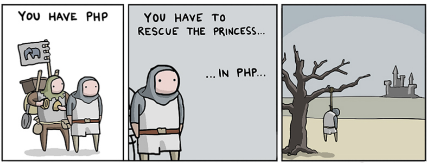
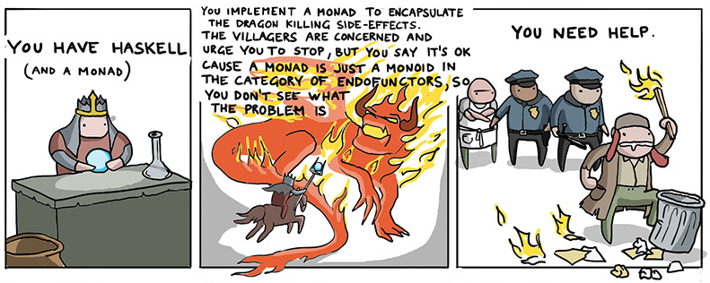

# Once upon a time

Once upon a time I was a PHP developer.
If you just smiled, you really should keep reading.

Yeah, once upon a time I was a PHP developer.
When I reveal this shocking fact to some of my colleagues they say "I'm sorry to hear that".

I understand your smile; I understand my colleagues' empathy.  
After all, a large part of the world wide web has been built in PHP.  
Why so popular? Well, it was designed to be simple: interpreted, dynamic types, garbage collection.  
You can inject PHP snippets directly into the HTML page.  
Global state and dollars everywhere.  

It was easy to write code that (occasionally) works.  
It was even easier to write obscure, unmaintainable, spaghetti code that (rarely) works.  
It was not so easy to write clean code that works (most of the times).  



I am one of the lucky guys who made it, meaning I don't have to suffer this anymore.  
I went to the dark side.  
I chose the simplest solution.  
I chose Scala.  

And they all lived happily ever after.  

Hold on a second. What? Scala? The simplest solution? That feels kind of weird...

It's becoming increasingly frequent to meet other fellow developers 
who refers to Scala and its community with adjectives and nouns such as "bonkers", "for crazies", "overcomplicate mess".

Let's face it, the functional side of things requires a significant mindset shift.  
Have you ever been to a Scala conference?
Some of the people out there will throw at you words such as "endofunctors", "comonads", "kleisli".  
You might feel like you need a PHD in category theory.  
You might feel lost, confused and frustrated.



There's a simple solution to this. Actually, there are many. Have you ever heard of Kotlin for example?  
Concise, expressive and elegant, pleasant to read and write.  
It's a bit like Scala, but without its superpowers.  
Functions are still first class citizens, but you cannot possibly do things in a certain way.  
And that's fair enough, because maybe it wouldn't be the best way in most cases, right?

Well, the point is, you cannot know until you know.

## Why??

A wise man once told me:
> if you know, you have a choice; if you have a choice, you're a free man.

I don't actually recall where I took it from or if I just made it up.
The point is that it's true.  
You can be perfectly happy with whatever you already know,
and dismiss everything else because it sounds too complicate.  
You can just be a PHP developer forever.
Besides, isn't PHP [turing complete](https://en.wikipedia.org/wiki/Turing_completeness)??
I've actually learned today that also [MS PowerPoint is](https://www.andrew.cmu.edu/user/twildenh/PowerPointTM/Paper.pdf).  

Why bother then? Why Scala? Why getting involved at all with all that crazy functional stuff?

Because I want to know. Because I want to have a choice.

Now, if you went all the way down the rabbit hole 
and explored the abyss to finally make your way out of the tunnel 
you can probably stop reading here.


## The case

Let's take polymorphism for example.

In Java you can have different implementations of the same method with different type signature (overloading).
Of course, you can do the same in Scala.

Here's a Json encoder object:

```scala
object JsonEncoder {
  def encode(value: Int): String = value.toString
  def encode(value: Double): String = value.toString
}
```

You can actually use this:

```scala
JsonEncoder.encode(3)
JsonEncoder.encode(4.0)
```

Cool, I have a Json encoder capable of dealing with integers and doubles.  
Pretty useless, for now, let's make it more interesting.  

Let's say that I want to be able to encode also lists of numbers. First attempt:

```scala
object JsonEncoder {
  def encode(value: Int): String = value.toString
  def encode(value: Double): String = value.toString
  def encode(value: List[Int]): String = 
    "[" + value.map(encode).mkString(",") + "]"
  def encode(value: List[Double]): String = 
    "[" + value.map(encode).mkString(",") + "]"
}
```

Beautiful right? Not really.

First problem: code duplication. The two methods body are identical.  
Second problem: everytime we add an encoder for a new type `T`,
we'll also have to add a new `encode` method for `List[T]`.    
More importantly, this code does not compile because of type erasure.  

One solution that comes to my mind is to use generics and have something like:  

```scala
def encode[T](value: List[T], tEnc: T => String): String =
  "[" + value.map(tEnc).mkString(",") + "]"
```

The intuition is that given a list of `T` and an `encode` function from `T -> String`,
then I can build an `encode` function from `List[T] -> String`.

This complicates things a little, because now I need to explicitly pass a `JsonEncoder[T]`
to the list encoder: 

```scala
JsonEncoder.encode(List(1, 2, 3), JsonEncoder.encode)
```

As a user of the library, what I really want to do is:

```scala
JsonEncoder.encode(List(1, 2, 3))
```

Shame: close, but not good enough.


## Type classes

What is a type class?

Quoting Wikipedia: 
> In computer science, a type class is a type system construct that supports ad hoc polymorphism.  
> This is achieved by adding constraints to type variables in parametrically polymorphic types.

Vague? Cryptic? I can agree.  
Let's jump on an example and figure out how this concept can help us out here.

First, let's rethink our architecture.  
Instead of having a single object that knows how to encode everything,
we can have a generic interface that can be extended for concrete types:

```scala
trait JsonEncoder[T] {
  def encode(t: T): String
}

object JsonEncoder {
  val intEncoder = new JsonEncoder[Int] {
    override def encode(t: Int): String = t.toString
  }
  
  val doubleEncoder = new JsonEncoder[Double] {
    override def encode(t: Double): String = t.toString
  }
  
  def listEncoder[T](tEncoder: JsonEncoder[T]) = new JsonEncoder[List[T]] {
    override def encode(ts: List[T]): String = 
      "[" + ts.map(tEncoder.encode).mkString(",") + "]"
  }
}
```

It's a bit verbose, but we can work on it.
Since the `JsonEncoder` has only one *single abstract method*, it qualifies as a *functional interface* according to [Java 8 specs](https://docs.oracle.com/javase/8/docs/api/java/lang/FunctionalInterface.html). 
Hence we can create new instances by simply implementing a lambda expression `T -> String` for the `encode` method:

```scala
trait JsonEncoder[T] {
  def encode(t: T): String
}

object JsonEncoder {
  val intEncoder: JsonEncoder[Int] = (t: Int) => t.toString

  val doubleEncoder: JsonEncoder[Double] = (t: Double) => t.toString
  
  def listEncoder[T](tEncoder: JsonEncoder[T]): JsonEncoder[List[T]] = 
    (ts: List[T]) => "[" + ts.map(tEncoder.encode).mkString(",") + "]"
}
```

To recap, rather than having a bunch of encode methods, 
we have a `JsonEncoder` interface, instances for `Int` and `Double` and a factory method 
that can build a new encoder for a generic `List[T]`.

Here's how to use it:

```scala
import JsonEncoder._
intEncoder.encode(1)
doubleEncoder.encode(2.0)
listEncoder(intEncoder).encode(List(1, 2, 3))
```

Now, from a user prospective, things got even worse.
1) I need to write more code
2) I am supposed to know the name of the specific `JsonEncoder` instance that I need,
   and even how to build one!

Well, here's the idea.

What if the compiler was able to automatically figure out for us the right encoder to use 
given a value of type `T`?  
What if there was a magic, type-safe method for finding - at compile time - a `JsonEncoder[T]` for a specific `T`?

It's important to underline "at compile time".  
We don't want to deal with runtime errors here.  

Well, turns out that the Scala compiler is capable of helping us here.


### Implicits

Here we go, the most controversial functionality of Scala: Ladies and Gentlemen the *implicit*.

A super basic example:

```scala
implicit val magicNumber: Int = 3

def printNumber()(implicit number: Int) = println(number)
 
printNumber()
```

The code above will print 3 to the console.

How is it possible? Let's have a closer look line by line:

1) `implicit val magicNumber: Int = 3`  
   declares an implicit value for the type `Int`. 
2) `def printNumber()(implicit number: Int) = println(number)`  
   declares a function that takes an implicit parameter of type `Int` 
3) `printNumber()`  
   invokes the function without passing any value explicitly, but asking the compiler to resolve it. 

What about the following code?

```scala
implicit val magicNumber: Int = 3

def printString()(implicit string: String) = println(string)

printString()
```

The answer is: it does not compile.  
The compiler is in fact unable to find an implicit value for the type `String`.

Another important thing about implicits is that you can build an implicit value
from other implicit values:

```scala
implicit val magicNumber: Int = 3

// Builds an implicit of type String from an implicit of type Int
implicit def magicString(implicit number: Int): String = number.toString + "!"

def printString()(implicit string: String) = println(string)

printString()
```

The code above compiles and prints "3!" as we would expect.

How is this going to help us with our `JsonEncoder`?

```scala
trait JsonEncoder[T] {
  def encode(t: T): String
}

object JsonEncoder {
  def encode[T](t: T)(implicit encoder: JsonEncoder[T]): String =
    encoder.encode(t)

  implicit val intEncoder: JsonEncoder[Int] = (t: Int) => t.toString

  implicit val doubleEncoder: JsonEncoder[Double] = (t: Double) => t.toString
  
  implicit def listEncoder[T](implicit tEncoder: JsonEncoder[T]): JsonEncoder[List[T]] = 
    (ts: List[T]) => "[" + ts.map(tEncoder.encode).mkString(",") + "]"
}
```

Amazingly, our users can now magically do something like:

```scala
JsonEncoder.encode(List(1, 2, 3))
```

What we just implemented is an example of a type class.


### References 

- [Scala with Cats](https://underscore.io/books/scala-with-cats)
- [Guide to Shapeless](https://underscore.io/books/shapeless-guide)
